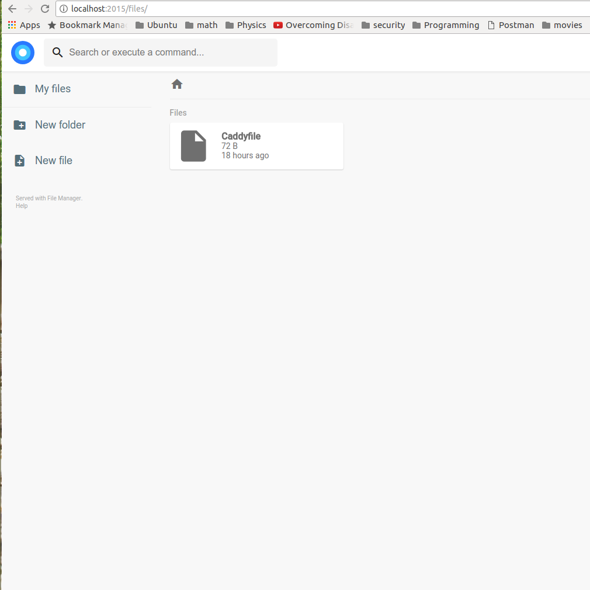
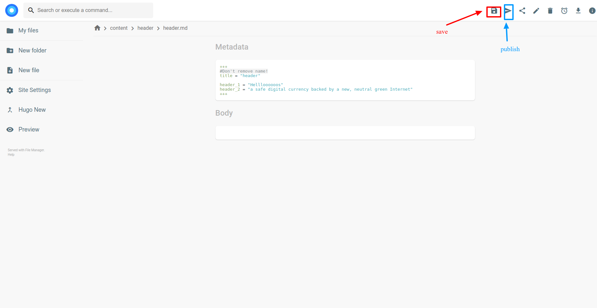
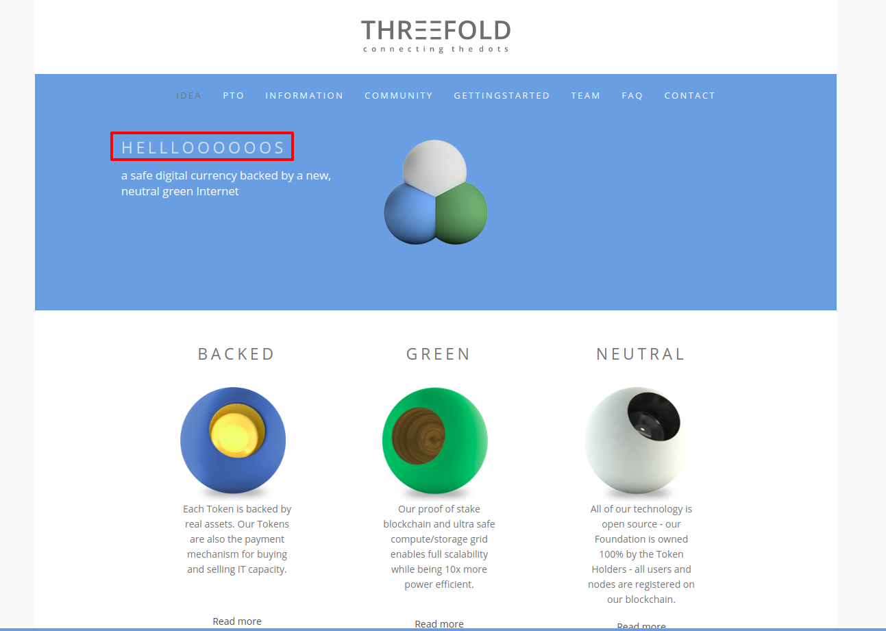

## Motivation
- caddyman is a simple script to install [Caddy](https://caddyserver.com) plugins
- [Caddy](https://caddyserver.com) has no smooth way to install plugins, and we have 3 ways
    - [Download](https://caddyserver.com/download) a binary directly with the desired plugins needed
    - Use [Caddyplug](https://github.com/abiosoft/caddyplug) but this only works on linux.
    - Edit some caddy source files, adding proper imports for the desigred plugins then re-build caddy
        - Example: in oprder to add [IYO]() plugin support 

            - we have to edit some source code ```$GOPATH/src/github.com/mholt/caddy/caddy/caddymain/run.go```
        manually,then adding plugin import path before we build caddy again.i.e
            ```
                _ "github.com/mholt/caddy/caddyhttp"
            ```
            - some plugins require you also to add a directive here ```$GOPATH/src/github.com/mholt/caddy/caddyhttp/httpserver/plugin.go```
            in ```directives``` variablea as well for caddy to recognize this directive when used in caddy config file
- Caddyman does the step number 3 for you


## usage
-
```
./caddyman
usage: cadyman list                           (list available plugins)
               install plugin_name            (install plugin by its name)
               install_url url {directive}    (install plugin by url)

```


## examples

- List all available plugins that you can install by just name
```
    hamdy@hamdy:~/go/src/caddyman$ ./caddyman.sh list
    [upload] blitznote.com/src/caddy.upload
    [search] github.com/pedronasser/caddy-search
    [datadog] github.com/payintech/caddy-datadog
    [nobots] github.com/Xumeiquer/nobots
    [multipass] github.com/namsral/multipass/caddy
    [cache] github.com/nicolasazrak/caddy-cache
    [locale] github.com/simia-tech/caddy-locale
    [hugo] github.com/hacdias/filemanager/caddy/hugo
    [ipfilter] github.com/pyed/ipfilter
    [cors] github.com/captncraig/cors/caddy
    [reauth] github.com/freman/caddy-reauth
    [grpc] github.com/pieterlouw/caddy-grpc
    [jsonp] github.com/pschlump/caddy-jsonp
    [expires] github.com/epicagency/caddy-expires
    [proxyprotocol] github.com/mastercactapus/caddy-proxyprotocol
    [git] github.com/abiosoft/caddy-git
    [minify] github.com/hacdias/caddy-minify
    [gopkg] github.com/zikes/gopkg
    [authz] github.com/casbin/caddy-authz
    [filemanager] github.com/hacdias/filemanager/caddy/filemanager
    [iyo] github.com/itsyouonline/caddy-integration/oauth
    [realip] github.com/captncraig/caddy-realip
    [mailout] github.com/SchumacherFM/mailout
    [webdav] github.com/hacdias/caddy-webdav
    [restic] github.com/restic/caddy
    [awslambda] github.com/coopernurse/caddy-awslambda
    [filter] github.com/echocat/caddy-filter
    [jekyll] github.com/hacdias/filemanager/caddy/jekyll
    [prometheus] github.com/miekg/caddy-prometheus
    [awses] github.com/miquella/caddy-awses
    [cgi] github.com/jung-kurt/caddy-cgi
    [ratelimit] github.com/xuqingfeng/caddy-rate-limit
    [jwt] github.com/BTBurke/caddy-jwt
    [login] github.com/tarent/loginsrv/caddy

````


- Install a plugin by name
```
    hamdy@hamdy:~/go/src/caddyman$ ./caddyman.sh install hugo
    Using GPATH : /home/hamdy/go
    Ensuring Caddy is up2date [SUCCESS]
    github.com/hacdias/filemanager/caddy/hugo
    Getting plugin [SUCCESS]
    Updating plugin imports in $CADDY_PATH/caddy/caddymain/run.go [SUCCESS]
    Copying caddy binary to //home/hamdy/go/bin [SUCCESS]

```

- Trying to install a non-existent plugin name
```
    hamdy@hamdy:~/go/src/caddyman$ ./caddyman.sh install hugosss
    Plugin name is not recognized

```

- For non supported plugins (not in ```./caddyman list```, you can provide the plugin url
    - Following example, iyo plugin needs a directive called ```oauth``` ```
./caddyman.sh install_by_url github.com/itsyouonline/caddy-integration/oauth oauth```
    - Another example for a plugin that doesn't require a directive ```./caddyman.sh install_by_url github.com/abiosoft/caddy-git```


## some useful plugins with full examples
- **filemanager**
    ```
    ./caddyman install filemanager
    mkdir fm
    cd fm
    # create Caddyfile with the following content
    cat > Caddyfile

    http://localhost:2015

    filemanager {
            database        db
            no_auth
    }
    ctrl + D

    # Run caddy
    caddy
    ```
    

- **hugo**
[hugo](http://gohugo.io/) plugin is a filemanager plugin in its essence
it allows for displaying hugo's generated static files as well as updating them

    ```
    ./caddyman install hugo
    git clone ssh://git@docs.greenitglobe.com:10022/ThreeFold/www_threefold2.0.git
    cd www_threefold2.0.git/
    cat > Caddyfile

        http://localhost:2015

                root www.threefoldtoken.com/en
                hugo www.threefoldtoken.com {
                    database db
                    no_auth
                }


        ctrl + D

        # Run caddy
        caddy
    ```

    
    
    